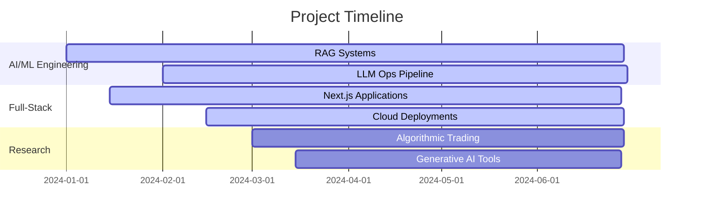

# 🚀 Raviprakash Mishra  
**AI/ML Engineer & Full-Stack Developer**  
*Building intelligent systems at the intersection of deep learning, generative AI, and modern web development*

---

## ✨ Dynamic Profile Overview

  
 | 
:---:|:---:

---

## 🎯 **Professional Focus Areas**

<table align="center">
  <tr>
    <td align="center" width="33%">
      
       
      <b>AI/ML Engineering</b>
       
      LLMs • RAG • Computer Vision
    </td>
    <td align="center" width="33%">
      
       
      <b>Full-Stack Development</b>
       
      React • Next.js • Cloud Native
    </td>
    <td align="center" width="33%">
      
       
      <b>Generative AI</b>
       
      Prompt Engineering • LLM Ops
    </td>
  </tr>
</table>

---

## 📊 **Live GitHub Analytics**

|  |  |
| :---: | :---: |
|  |  |

---

## 🛠 **Technology Ecosystem**

### 🏗️ **Core Development**

  

### ☁️ **Cloud & DevOps**

### 🤖 **AI/ML Stack**

---

## 📈 **Current Projects & Focus**

  

### 🔥 **Active Development**
- 🚀 **Semantic RAG Systems** with vector databases and real-time indexing
- 🌐 **Next.js 14 Applications** with server components and edge runtime
- ⚡ **AI-Powered Trading Bots** with real-time analytics dashboard
- 🎨 **Generative UI Components** with dynamic prompt engineering

---

## 🎮 **Interactive Skills Matrix**

<table align="center">
  <tr>
    <th>Skill</th>
    <th>Proficiency</th>
    <th>Visualization</th>
  </tr>
  <tr>
    <td>AI/ML Engineering</td>
    <td>Expert</td>
    <td></td>
  </tr>
  <tr>
    <td>Full-Stack Dev</td>
    <td>Expert</td>
    <td></td>
  </tr>
  <tr>
    <td>Cloud Architecture</td>
    <td>Advanced</td>
    <td></td>
  </tr>
  <tr>
    <td>Generative AI</td>
    <td>Expert</td>
    <td></td>
  </tr>
  <tr>
    <td>UI/UX Design</td>
    <td>Advanced</td>
    <td></td>
  </tr>
</table>

---

## 🌟 **Featured Projects**

| Project | Description | Tech Stack | Status |
|---------|-------------|------------|--------|
| **AI Trading Platform** | ML-powered algorithmic trading with real-time analytics | Python, FastAPI, React, Redis | 🚀 Live |
| **Intelligent RAG System** | Semantic search with vector embeddings and LLM integration | LangChain, Pinecone, Next.js | 🔧 Active |
| **Generative UI Builder** | AI-assisted component generation and design system | OpenAI, Figma API, React | 💡 In Dev |

---

## 📱 **Connect With Me**

---

## 📊 **GitHub Metrics**

---

## 🎯 **Quick Stats**

  

---

## 💡 **Recent Thoughts**

> "Building intelligent systems requires both **mathematical rigor** and **creative intuition** – it's where art meets science in the digital realm."

⭐ *Star my repositories if you find them interesting!* ⭐  
🔄 *Updated dynamically with every commit* 🔄

---

*✨ Crafted with precision for the modern developer experience*  
*⚡ Last Updated: *
